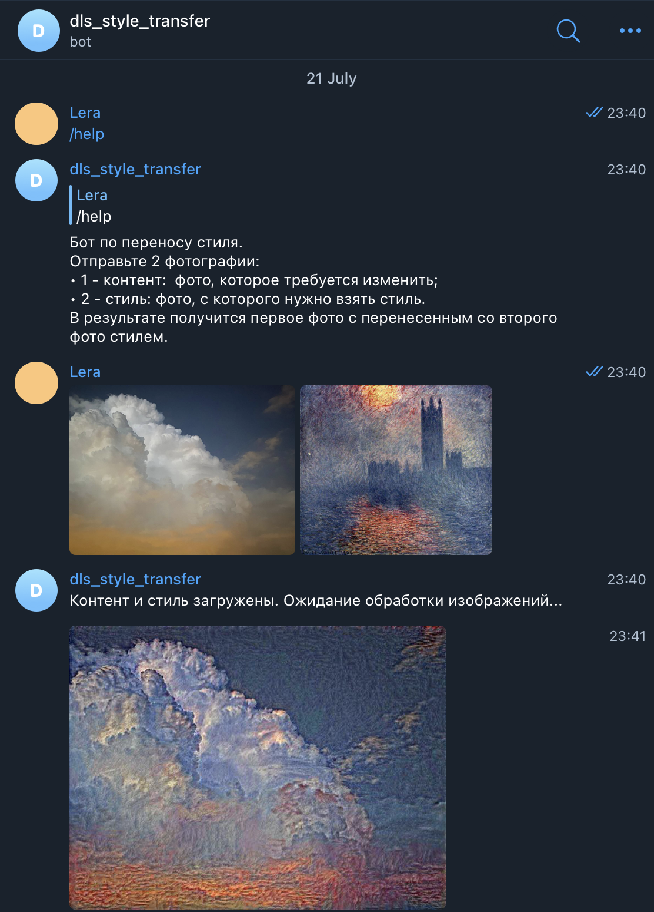

# Style transfer bot

## Цель
Цель проекта:
1. Реализовать модель, которая переносит стиль с одного изображения на другое.
2. Разработать telegram бота, принимающего на вход два изображения и отдающего на выход изображение с перенесенным стилем.

## Модель
Был реализован медленный алгоритм на основе [статьи](https://pytorch.org/tutorials/advanced/neural_style_tutorial.html). 
Ноутбук с обучением модели и некоторыми примерами - /notebooks/style_transfer_model.ipynb.


## Telegram-бот
Telegram бот реализован с помощью библиотеки aiogram, с поддержкой асинхронности и CUDA. Запуск бота в docker-контейнере (необходим токен):
```
docker-compose up -d
```

